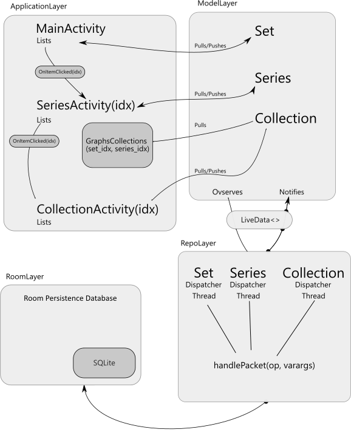

# Data Logger

Allows the user to record generic data sets. The app separates the data by sets, which can house N number of series per set. Each series can have a collection of entries associated with it. Entries are stored with a value and a date/time. Then a basic chart library will plot all of the collection elements for a specific set. The x-axis represents the time difference in days starting from the earliest logged time. The y-axis represents the range of all entered values.  

[ScreenShots](design/README.md) of the running application.

## Directories

* [Source](https://github.com/CharlesCarley/java-ccarley/blob/master/datalogger/app/src/main/java/com/github/charlescarley/datalogger)
* [Design](https://github.com/CharlesCarley/java-ccarley/blob/master/datalogger/design)
* [Resource](https://github.com/CharlesCarley/java-ccarley/blob/master/datalogger/app/src/main/res)

## Packages

* [datalogger](https://github.com/CharlesCarley/java-ccarley/blob/master/datalogger/app/src/main/java/com/github/charlescarley/datalogger)
  * [charts](https://github.com/CharlesCarley/java-ccarley/blob/master/datalogger/app/src/main/java/com/github/charlescarley/datalogger/charts)
  * [models](https://github.com/CharlesCarley/java-ccarley/blob/master/datalogger/app/src/main/java/com/github/charlescarley/datalogger/models)
  * [room](https://github.com/CharlesCarley/java-ccarley/blob/master/datalogger/app/src/main/java/com/github/charlescarley/datalogger/room)
  * [repositories](https://github.com/CharlesCarley/java-ccarley/blob/master/datalogger/app/src/main/java/com/github/charlescarley/datalogger/repositories)
  * [models](https://github.com/CharlesCarley/java-ccarley/blob/master/datalogger/app/src/main/java/com/github/charlescarley/datalogger/models)

### Overview

A functional overview of the application.

